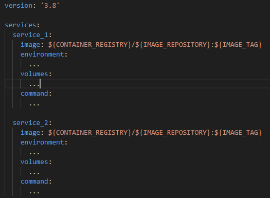
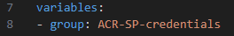
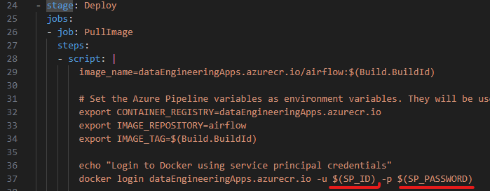
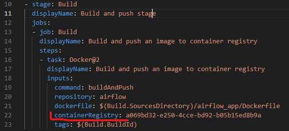
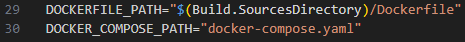
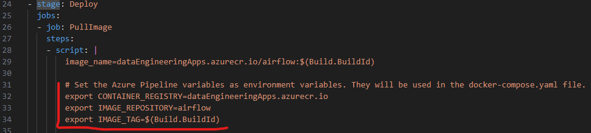
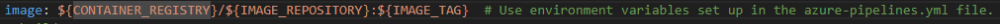

# Introduction
This repository contains code for preparing infrastructure for creating a CI/CD pipeline using Azure Pipelines which deploy an application as a Docker container on Azure Linux VM.

Code from this repo doesn't build the CI/CD pipeline itself. It only prepares all the resources needed and after that we can create a CI/CD pipeline on Azure DevOps website. 

More information about the workflow using this code is in the 'Repository guide' section further in this document.

More information about what CI/CD pipeline we can prepare and what app it can deploy (how to prepare a Dockerfile and docker-compose files) can be found in the 'CI/CD pipeline' and 'Dockerfile and docker-compose preparation - details' sections further in this document.

The Terraform code from the 'terraform' folder performs the following actions:
- **Create ACR** - For storing Docker images which we will be deploying
- **Create Service Principal** - For authentication when pushing and pulling images from ACR
- **Create Azure Linux VM** - Where we will be running a Docker container and a Self Hosted Agent
- **Execute a bash script on the created VM** - Which will install:
    - **Docker** - Needed for running app as a container
    - **Azure Pipelines Self Hosted Agent** - Needed to perform actions from our defined CI/CD pipeline
- **Generate SSH keys pair** - Which we can use for connecting to the created VM.

Code from the 'azure_devops' folder, using Azure DevOps Rest API performs the following actions:
- **Create an Agent Pool** - When installing a Self Hosted Agent we need to specify to which Agent Pool it will be added
- **Add Service Principal credentials to the Variable group in DevOps Library** - Which will be used for authentication when pulling a Docker image from the ACR in our CI/CD pipeline
- **Create a Service connection in DevOps linked to the ACR** - Which will be used for authentication when pushing a Docker image to the ACR in our CI/CD pipeline
- **Generate a YAML file** - Which defines what stepd will be performed in our CI/CD pipeline

Using infrastructure prepared by this code we can create a CI/CD pipeline deploying for example Airflow app from the airflow_data_lake_ingestion repository.

There is an issue with this code which is described in the 'Code issues' section further in this document.


# CI/CD pipeline
The CI/CD pipeline which we can build using infrastructure prepared using code from this repository, waits until we push code to the repo and once we do this it performs the following actions:
- Builds a Docker image using a Dockerfile included in the repo
- Pushes this Docker image to ACR (Azure Container Registry)
- Pulls the Docker image from ACR onto Azure Linux VM
- Runs a container using the pulled Docker image and docker-compose.yaml file from the repo on this VM

All those actions are done by a Self Hosted Agent from Azure Pipelines which we install on this VM using code from the 'terraform' folder in this repo.

How the pulled Docker image and docker-compose are used together to run the app? For example, we can have a docker-compose file like that:



In that case, we are running two containers (services) which uses the Docker image pulled from the ACR and we execute a specified command to start an app in those containers.

We are using the same Docker image for every container in this example, but this could be extended to multiple, different images.

More details about how Dockerfile and docker-compose files should be prepared can be found in the 'Dockerfile and docker-compose preparation - details' section in this document.


# Repository guide
Here is an explanation about how to use code from this repository. In short we need to follow those steps:
- Satisfy all the prerequisites (more info in the 'Prerequisites' section further in this documentation)
- Create an Agent Pool
- Create Azure resources
- Create resources in Azure DevOps and generate a YAML file
- Move the generated YAML file to the repo and create a CI/CD pipeline

Below each of those steps is explained in more detail.

## Create an Agent Pool
Before we install a Self Hosted Agent on Azure Linux VM, we need to prepare an Agent Pool in Azure Pipelines where that Agent will be added.

In order to create an Agent pool we can use the azure_devops > ci_cd_setup > agent_pool_setup > setup.py script.

## Create Azure resources
All the Azure resources which we need are:
- ACR
- Service Principal
- Linux VM (with installing on it Docker and Agent)

We will create them using Terraform code from the 'terraform' folder. 

Before we run this Terraform code we need to have the Agent Pool prepared as described in the previous step. Also in that Pool there can't be any Agent with the same name as the new Agent we want to create. Otherwise, configuration of this VM will fail.

In order to run this code, we need to go to the 'terraform' folder in a terminal and execute the following commands:
```
terraform init # only when running that Terraform code for the first time
terraform plan -out main.tfplan
terraform apply main.tfplan
```

## Connecting to the created VMs from our local computer through SSH
The Terraform code will generate SSH keys pair, save the private key on our local computer and add the public key to the authorized keys on the created VMs.

Then we can connect to the created VMs by using this command on our local computer:
>ssh username@ip_address

Here is described how to get values needed for SSH connection:
- **ip_address** - In order to get IP addresses of the created VM we need to use the Terraform outputs called 'public_ip_address'. More info about those outputs in the 'Terraform outputs' section of this documentation.
- **username**- The username value is specified by the vm_username Terraform variable ('azureadmin' by default).

More information about how this works is further in this document in the 'SSH key generation' section.

## Create resources in Azure DevOps and generate a YAML file
In order to create all the resources in Azure DevOps and generate a YAML file we will use files from the azure_devops > ci_cd_setup > acr_push_and_pull folder.

At first we need to provide proper values for the following variables in the .env file in that folder:
- TENANT_ID
- SP_ID
- SP_PASSWORD

They are related to the Service Principal which we created using Terraform before.

We can get all those values from Terraform outputs as described in the 'Terraform outputs' section further in this documentation.

Now we can run the acr_push_and_pull > setup.py script which will:
- Create a Variable group in DevOps Library - containing Service Principal credentials
- Create a Service Connection - linked to the created ACR
- Generate a YAML file defining what steps will be performed in our CI/CD pipeline

Generated YAML file will be saved in the same folder as the setup.py script.

## Move the generated YAML file to the repo
Now we can move the generated YAML file to the repository with code of the application which we want to deploy.

## Dockerfile and docker-compose preparation
In order to deploy our app using this generated YAML file, we need to properly prepare Dockerfile and docker-compose files. It is described in detail in the 'Dockerfile and docker-compose preparation - details' section at the end of this document.

## Create a CI/CD pipeline
Now we can create a CI/CD pipeline from Azure DevOps website. When doing that, we should indicate that we want to use the YAML file which we created. This option might be selected automatically.

## Azure Pipeline permissions
When we want to run a pipeline for the first time, using a newly created resources in DevOps, we need to run the pipeline, go to a website with its status and add permissions to use new resources.

## Cleaning up Azure resources
After we are finished we can destroy all the resources created in Azure. In order to do that, we need to use the following commands:
```
terraform plan -destroy -out main.destroy.tfplan
terraform apply main.destroy.tfplan
```

## Cleaning up DevOps resources
After we are finished we can delete all the DevOps resources which we created. In order to do that, we can use the cleanup.py scripts from both folders from the azure_devops > ci_cd_setup folder:
- acr_push_and_pull
- agent_pool_setup

They take information from the .env files which we already prepared to identify which resources to delete.


# Prerequisites
Before we start using this code we need to perform steps described in the below subsections:
- Get an Azure subscription
- Install and configure Terraform on our computer
- Create the terraform.tfvars file and specify Terraform variables there
- Create .env files
- Set up Python virtual environment

## Azure subscription
We need to have a subscription on the Azure platform portal.azure.com.

## Terraform configuration
We need to configure properly Terraform so it can create resources in our Azure subscription, it is described here: [developer.hashicorp.com](https://developer.hashicorp.com/terraform/tutorials/azure-get-started/azure-build).

When following this instruction, we need to perform only one step in a different way then it is described in that instruction. And that is caused by the fact that we want to allow Terraform to create Service Principals. 

When Terraform is creating Azure resources it is authenticating using a Service Principal. In order to allow Terraform to create other Service Principals, we need to create a Service Principal with proper permissions which will be used by Terraform for authentication. 

In the ‘Authenticate using the Azure CLI > Create a Service Principal’ section in the instruction on developer.hashicorp.com we are creating a service principal with the ‘Contributor’ Azure role and we need to change it into ‘Owner’.

Also it is useful to add some name to the created service principal, for example ‘Terraform’. We can do this by using the ‘az ad sp create-for-rbac’ command with the ‘--name’ parameter.

Additionaly we need to assign the ‘Application Administrator’ Entra role to that service principal. It is described here how to do this: [docs.azure.cn](https://docs.azure.cn/en-us/entra/identity/role-based-access-control/manage-roles-portal?tabs=admin-center)

## Terraform variables
Before using this code we need to create terraform.tfvars file which looks like the terraform-draft.tfvars file and save it in the same location. In this draft file is described what values we need to provide.

We are assigning there values to variables defined in the variables.tf file located in the same folder. In the variables.tf file we can also find descriptions and default values of those variables.

As it is written in a comment in the terraform-draft.tfvars file, it is necessary to provide values for just a few of variables, not all of them.

## .env file configuration
Before using this code we need to additionally create the .env file in two subfolders in the azure_devops > ci_cd_setup folder:
- acr_push_and_pull
- agent_pool_setup

In those files we need to specify values for a few environment variables which will be used in code using the dotenv module and os.getenv('env_variable_name') function. 

Those files should look like the .env-draft file included in those folders and they should be saved in the same location. In those files it is described what values to provide.

Before we provide values for some of those variables, we need to run the Terraform code first as described in the 'Repository guide' section earlier in this document. In those .env-draft files we have comments indicating which variables those are.

As it is written in a comment in the .env-draft file, it is necessary to provide values for just a few of variables, not all of them.

## Set up Python virtual environment
Create a venv:
>py -m venv venv

And install all the requirements:
>pip install requirements.txt

Before running any Python code from the azure_devops folder, activate a venv:
>venv/Scripts/activate <- for Windows


# Code explanation
Here is a brief explanation of the most important aspects about how this code works.

## Terraform code
This section explains the Terraform code from the 'terraform' folder.

### The 'modules' folder
That folder contains Terraform modules where each module is creating different Azure resources.

### Terraform outputs
Terraform code creates a few outputs which we are gonna need:
- public_ip_address - Public IP address of the created VM
- sp_id - app / client ID of the created Service Principal
- sp_password - password of the created Service Principal
- tenant_id - ID of the Tenant of the created Service Principal

Those outputs will be printed in a console once the 'terraform apply' command is finished. We can also access those values using one of those commands:
- >terraform output # print all the outputs
- >terraform output -raw <output-name> # print a specific output

The sp_password output is sensitive so it won't be printed in a console. In order to get its value we need to use the `terraform output -raw <name>` command for getting a specific output.

### SSH key generation
We are using the modules/ssh module which generates SSH keys as strings which are saved on our local computer and created VMs. They will be used for connecting to the created VMs.

The ssh_path Terraform variable specifies where on our local computer the private key will be saved. The recommended one for Windows is C:\\Users\\username\\.ssh\\id_rsa (if we save the private key here then we don't need to provide a path to that key when running the 'ssh' command).

### Bash script
The terraform > install_tools.sh.tftpl file is a bash script template which will be executed on the created VM and will install Docker and Self Hosted Agent on it.

It is executed using the azurerm_virtual_machine_extension Terraform resource which uses Azure VM Extension.

That bash script can't be used on its own on a Linux machine since it is rendered using the Terraform templatefile function first before execution. More information about that here [developer.hashicorp.com](https://developer.hashicorp.com/terraform/language/functions/templatefile).

We are inserting into that script variables specified in the templatefile function (what can be found in the terraform > main.tf script) and also we are using there escape sequences. More information about that here [developer.hashicorp.com](https://developer.hashicorp.com/terraform/language/expressions/strings).

Logs from executing a bash script on VM can be found on that VM in the /var/lib/waagent/custom-script/download/0/ folder. There are the 'stdout' and 'stderr' files with logs. More info about that here: [learn.microsoft.com](https://learn.microsoft.com/en-us/azure/virtual-machines/extensions/troubleshoot).


## DevOps Rest API code
This section explains code from the azure_devops > ci_cd_setup folder. We have there two subfolders:
- agent_pool_setup - Contains code for creating an Agent Pool where we will be adding a Self Hosted Agent which we will install on Azure Linux VM.
- acr_push_and_pull - Contains code for creating:
    - Variable group in DevOps Library
    - Service Connection in DevOps
    - YAML file

All the code from those folders uses Azure DevOps Rest API. In below sections we can find more details about how this code works.

### Create Agent Pool
The agent_pool_setup > setup.py script can be used to create Agent Pool where we can add Self Hosted Agents installed on a VM. 

Ceating an Agent Pool is necessary before installing an Agent on a VM. Otherwise installation will fail.

### Add Service Principal credentials to the Variable group in DevOps Library
The acr_push_and_pull > setup.py script creates a variable group with a specified name and create there variables:
- SP_ID - Equals to a Service Principal application ID
- SP_PASSWORD - Equals to a Service Principal password 

Those variables are used in the YAML file defining a CI/CD pipeline in order to authenticate when pulling a Docker image from ACR. 

We are including this variable group name this way:



This will allow to access variables SP_ID and SP_PASSWORD which are used in the bash script which is pulling Docker image onto the VM:



### Create a Service Connection in DevOps linked to the ACR
We create a Service Connection in DevOps linked to the ACR which we prepared.

It uses the same Service Principal for authentication which credentials we added to the Variable Group in DevOps Library.

It will be used in the YAML file for pulling images from the ACR.

Once we create this connection we are adding its ID to the generated YAML file as the 'containerRegistry' argument:

YAML file:\


Note: Every time we create a Service Connection in DevOps, it automatically creates a new Service Principal in Azure with a name of the format \<organization>-\<project>-xxx, where organization and project can be taken from DevOps URL: dev.azure.com/\<organization>/\<project>

### Generate a YAML file
We will generate a YAML file defining actions to perform in our CI/CD pipeline. 

This file will need to be added manually to the repo containing the code which we want to deploy onto the VM. 

It will contain an information about:
- Created Variable group in DevOps Library
- ID of the created Service connection linked to the ACR
- Name of the Agent pool to use
- Name of the ACR which will be used

Once we have the Variable group and Service connection in DevOps created, and YAML file generated, we can move this YAML file to the repository we want to deploy and create a CI/CD pipeline on DevOps website. 

### Logs
There is defined a class 'Logs' in the classes > class_logs.py file. It is used when creating and deleting resources in DevOps. It creates a folder 'logs' and a file 'logs.csv' containing information about which resources were created and deleted, and at what time.


## Dockerfile and docker-compose preparation - details
In order to run a CI/CD pipeline using the generated YAML file and created DevOps resources successfuly, we need to properly set up a Dockerfile and docker-compose files in the repository which we want to deploy.

This code assumes that both files are located in the root of the repository and they are called 'Dockerfile' and 'docker-compose.yaml'. 

If we want to put those files in a different location or call them differently, then we need to change those variables' values in the azure_devops > ci_cd_setup > acr_push_and_pull > .env file:



During execution of a CI/CD pipeline, before pulling an image onto the VM, we create environment variables which will be used in the docker compose file. They indicate which image to pull and from which container registry.

We create them in the YAML file generated by the azure_devops > ci_cd_setup > acr_push_and_pull > setup.py script:



In the docker compose file we should use them to indicate which image to pull:




# Code issues
## Pushing code to ACR in CI/CD pipeline doesn't work
When we run a CI/CD pipeline using resources prepared by this code, we get an error that we are not authorized to push a Docker image to ACR.

This will be related to the Service Connection which we create in DevOps and Service Principal which is used to create that Service Connection. That Service Connection is used for authentication when pushing imaged to ACR.

That code was working before. I am not sure what might be wrong. It might be worth to create a Service Connection manually using our Service Principal. If that works, then that means that the Rest API call which we make to create that Service Connection automatically doesn't work.